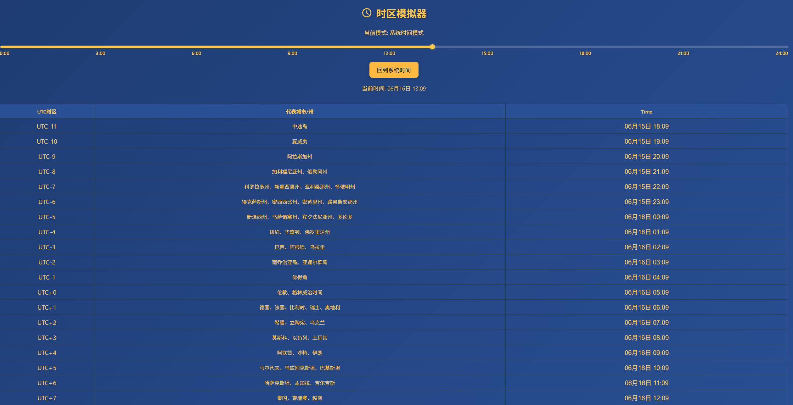

# timezonebar

一款时区模拟计算器，基于您当前的时区，计算其他时区所对应的时间，支持手动输入
=======

**TimezoneBar** 是一款轻量级的时区模拟计算工具。支持开箱即用的本地运行，也可轻松部署为在线 Web 服务。

### 适用人群
它专为以下群体设计，助您精准把控全球时间流转，告别时差误判：

* **跨境电商从业者**：用于精确把控广告投放、直播及运营的时间节奏。
* **高频出差群体**：快速换算异地时间，减少跨时区飞行带来的时间混乱。
* **全球远程协作团队**：便捷协调跨国会议，避免沟通上的时差冲突。
* **数字游民 (Digital Nomads)**：随时掌握所在地与家乡及目标市场的时差。
* **海外留学生及家长**：实时了解远方亲友的当地时间，精准联系。

### 运行与部署
本项目为纯前端静态架构，支持以下两种使用场景：

**场景一：本地极速使用**
1. 点击页面右侧 **"Code" -> "Download ZIP"** 下载源码并解压。
2. 双击 `index.html` 即可在本地浏览器中直接运行。

**场景二：在线托管部署**
支持将其放置在任何 Web 服务器（如 Nginx / Apache）的目录中。由于零后端依赖，亦可零成本一键接入 Cloudflare Pages、Vercel 等现代静态托管平台。

### 项目结构
* `index.html`：页面骨架与结构
* `style.css`：视觉与排版样式
* `script.js`：核心时区计算逻辑

### 核心优势
* **纯客户端计算**：所有运算基于浏览器完成，不依赖后端接口，响应极速且保障用户隐私。
* **原生轻量**：纯静态文件架构，零依赖，无需配置复杂的构建工具链。

 0c21b95 (docs: 更新 README 文档，完善项目介绍与部署说明)
